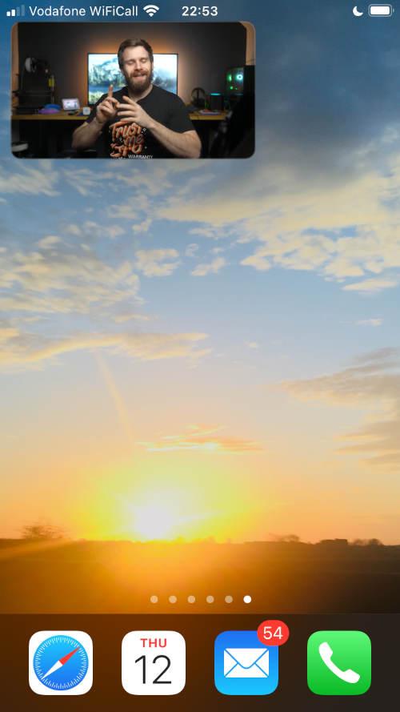

# Home Assistant Add-on: PodTube

This addon builds on the excellent PodTube python script here:
https://github.com/aquacash5/PodTube

## How to use

1. Visit https://console.cloud.google.com/apis/credentials
2. Create a new project, (you can leave the organisation as 'No organisation')
3. Select the project you just created.
4. Click 'CREATE CREDENTIALS' then 'API key'
5. Copy the API key to the clipboard
6. Navigate to the PodTube Configuration tab
7. Paste the API key into the `google_api_key` option box.
8. Click 'Save', navigate back to the 'Info' tab, then click 'Start'

## Example uses:

### View one video

Starting from a video url e.g.

```
https://www.youtube.com/watch?v=D936T1Ze8-4
```

Extract video id `D936T1Ze8-4` and create the URL:

```
http://homeassistant.local:9876/video/D936T1Ze8-4
```

PodTube will now respond to this URL with the single video without ads. You can download the video as an mp4 by right-clicking.

The process can be automated further and added to an iOS share sheet using a
[shortcut like this](https://www.icloud.com/shortcuts/2f01d59d3f714dfab7e938561f5262ea), allowing you trigger PodTube from the YouTube app in iOS (share > more > YouTube NoAds Safari). These videos can be played picture-in-picture, background, full screen, audio only with the screen off, etc.



### Playlists

Get the playlist id from the youtube url

```
https://www.youtube.com/playlist?list=<PlaylistID>
```

Add the url to your podcast client of choice

```
http://homeassistant.local:9876/playlist/<PlaylistID>
```

If you want an audio podcast add a /audio to the url

```
http://homeassistant.local:9876/playlist/<PlaylistID>/audio
```

### Channels

Get the channel id or username from the youtube url

```
https://www.youtube.com/channel/<ChannelID>
```

or

```
https://www.youtube.com/user/<Username>
```

Add the url to your podcast client of choice

```
http://homeassistant.local:9876/channel/<ChannelID>
```

or

```
http://homeassistant.local:9876/channel/<Username>
```

If you want an audio podcast add a /audio to the url

```
http://homeassistant.local:9876/channel/<Username>/audio
```

### More

For more examples see
https://github.com/aquacash5/PodTube
